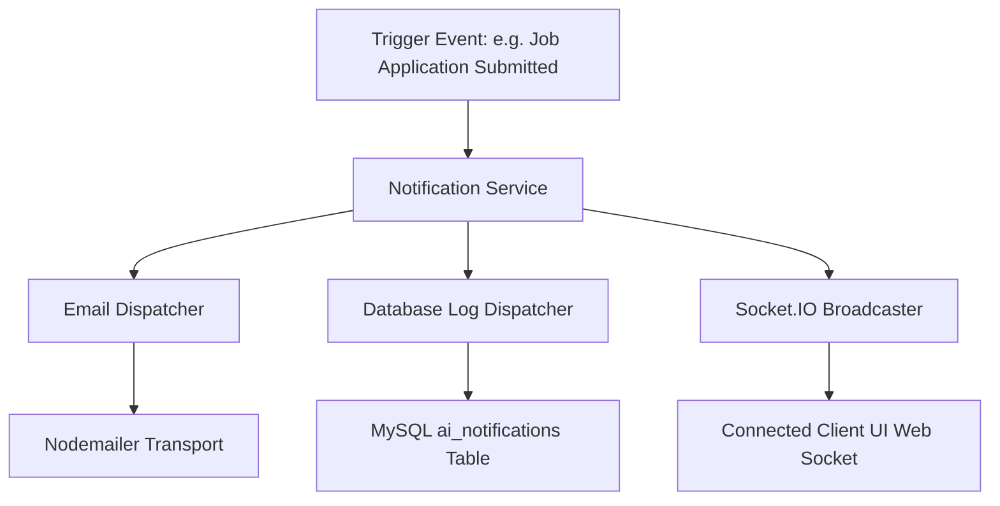

# Extended System Architecture Design: Integrated Career & Recruitment Portal

This document outlines the complete, production-ready system architecture for the **Integrated Career and Recruitment Portal**. It is designed to support three distinct user roles (**Student**, **Employer**, and **Admin**) and is extended to integrate advanced production features: **AI Modules**, **Multi-channel Notifications (Email, In-app, Socket.IO)**, **Interview Calendar Scheduling**, a dynamic **Resume Builder**, **Role-specific Analytics Dashboards**, and a **Cloud-Agnostic Storage Abstraction**.

---

## 1. Complete Project Directory Structure (Extended)

```
Integrated-Career-And-Recruitment-Portal/
├── backend/                         # Express API Backend
│   ├── src/
│   │   ├── ai/                      # [NEW] Dedicated AI Module
│   │   │   ├── ai.controller.js     # AI endpoints orchestrator
│   │   │   ├── ai.routes.js         # Routes mapping for AI requests
│   │   │   ├── ai.service.js        # Main AI orchestrator service
│   │   │   ├── prompt.service.js    # System prompts & template manager
│   │   │   ├── resumeParser.service.js # Resume parser using LLM/AI parsing
│   │   │   ├── jobMatcher.service.js # Match profiles to job descriptions
│   │   │   └── interview.service.js # Conduct dynamic mock interviews
│   │   ├── config/                  # Configuration settings
│   │   │   ├── db.config.js         # MySQL connection pool
│   │   │   ├── mailer.config.js     # Nodemailer SMTP transporter
│   │   │   ├── cors.config.js       # CORS domains whitelist
│   │   │   ├── security.config.js   # JWT & Bcrypt configs
│   │   │   ├── socket.config.js     # [NEW] Socket.IO initialization settings
│   │   │   └── storage.config.js    # [NEW] Active Storage driver toggle config
│   │   ├── controllers/             # Core module controllers
│   │   │   ├── auth.controller.js
│   │   │   ├── student.controller.js
│   │   │   ├── employer.controller.js
│   │   │   ├── admin.controller.js
│   │   │   ├── notification.controller.js # [NEW] Handles in-app notifications
│   │   │   ├── calendar.controller.js     # [NEW] Handles interview calendars
│   │   │   └── resume.controller.js       # [NEW] Handles resume builder operations
│   │   ├── middlewares/             # Request pre-processors
│   │   │   ├── auth.middleware.js   # JWT token verifier
│   │   │   ├── role.middleware.js   # Role-based protection rules
│   │   │   ├── upload.middleware.js # Multer multipart handler
│   │   │   ├── validation.middleware.js # Body schemas validator
│   │   │   └── error.middleware.js  # Global centralized error handler
│   │   ├── models/                  # Database queries / schemas
│   │   │   ├── user.model.js        # Auth accounts data
│   │   │   ├── student.model.js     # Profiles data
│   │   │   ├── employer.model.js    # Corporate data
│   │   │   ├── job.model.js         # Job postings parameters
│   │   │   ├── application.model.js # Jobs applications mapping
│   │   │   ├── notification.model.js # [NEW] In-app notification logs
│   │   │   ├── interview.model.js   # [NEW] Interview schedules, dates, and statuses
│   │   │   ├── resume.model.js      # [NEW] Resume templates & version histories
│   │   │   └── analytics.model.js   # [NEW] Aggregated queries for metrics
│   │   ├── routes/                  # API routing maps
│   │   │   ├── index.js             # Root API registry (v1 router)
│   │   │   ├── auth.routes.js
│   │   │   ├── student.routes.js
│   │   │   ├── employer.routes.js
│   │   │   ├── admin.routes.js
│   │   │   ├── notification.routes.js # [NEW] Notification paths
│   │   │   ├── calendar.routes.js     # [NEW] Interview scheduling routes
│   │   │   └── resume.routes.js       # [NEW] Resume templates and files routes
│   │   ├── services/                # Business logic engines
│   │   │   ├── email.service.js     # Email delivery service
│   │   │   ├── token.service.js     # JWT generator
│   │   │   ├── storage/             # [NEW] Storage Abstraction Layer
│   │   │   │   ├── storage.service.js # Interface client for uploads (Local/S3/Cloudinary)
│   │   │   │   ├── local.provider.js  # Local disk upload strategy
│   │   │   │   ├── s3.provider.js     # AWS S3 upload strategy
│   │   │   │   └── cloudinary.provider.js # Cloudinary upload strategy
│   │   │   ├── socket.service.js    # [NEW] Real-time event broadcasting service
│   │   │   ├── notification.service.js # [NEW] Multi-channel notification pipeline
│   │   │   └── pdf.service.js       # [NEW] Resume PDF compilation engine
│   │   ├── utils/                   # Helpers
│   │   │   ├── AppError.js          # Unified custom error class
│   │   │   ├── constants.js         # HTTP and role definitions
│   │   │   └── dateHelper.js        # Time format converters
│   │   ├── app.js                   # Express pipeline configs
│   │   └── server.js                # Port listener & Socket.io server bootstrap
│   ├── uploads/                     # Local storage fallback directory
│   ├── .env.example                 # Config environment keys template
│   ├── package.json                 # Backend scripts and packages
│   └── README.md
│
├── frontend/                        # React (Vite) Frontend
│   ├── public/                      # Static static resources
│   ├── src/
│   │   ├── assets/                  # Core logos & default avatars
│   │   ├── components/              # Shared UI views
│   │   │   ├── common/              # Buttons, Inputs, Tables, Modals, Spinners, Toast
│   │   │   └── layouts/             # Dashboard header, footer, sidebars
│   │   ├── context/
│   │   │   ├── AuthContext.jsx      # Authentication wrapper
│   │   │   ├── SocketContext.jsx    # [NEW] React Context for active Socket connection
│   │   │   └── ThemeContext.jsx     # Visual mode preferences
│   │   ├── hooks/
│   │   │   ├── useAuth.js
│   │   │   ├── useSocket.js         # [NEW] Custom hook for real-time messages
│   │   │   ├── useFetch.js
│   │   │   └── useForm.js
│   │   ├── pages/                   # Visual components mapping
│   │   │   ├── public/              # Home, Login, Register, JobDetail, NotFound
│   │   │   ├── student/
│   │   │   │   ├── Dashboard/       # Dashboard + Analytics widgets
│   │   │   │   ├── Applications/    # Track job status logs
│   │   │   │   ├── Profile/         # Setup details and files
│   │   │   │   ├── FindJobs/        # Search panels
│   │   │   │   ├── ResumeBuilder/   # [NEW] Templates selection & live HTML-to-PDF views
│   │   │   │   ├── AIResumeReview/  # [NEW] AI feedback and suggestions
│   │   │   │   ├── AIResumeMatch/   # [NEW] Match profile score vs. target jobs
│   │   │   │   ├── AICareerMentor/  # [NEW] Mentorship chat screen
│   │   │   │   ├── AIInterview/     # [NEW] Interactive mock testing screen
│   │   │   │   └── InterviewCalendar/ # [NEW] Scheduling calendar view
│   │   │   ├── employer/
│   │   │   │   ├── Dashboard/       # Funnel analytics widgets
│   │   │   │   ├── PostJob/
│   │   │   │   ├── ViewApplicants/
│   │   │   │   ├── Profile/
│   │   │   │   ├── AICandidateRanking/ # [NEW] Rank applicants by AI compatibility
│   │   │   │   ├── AIJobGenerator/  # [NEW] AI-drafted job postings page
│   │   │   │   └── InterviewManager/ # [NEW] Schedule & update status page
│   │   │   └── admin/
│   │   │       ├── Dashboard/       # System metrics dashboard
│   │   │       ├── ManageUsers/
│   │   │       ├── ManageJobs/
│   │   │       └── PlatformAnalytics/ # [NEW] Extended server usage reports
│   │   ├── routes/
│   │   │   ├── AppRoutes.jsx        # Routing tree setup
│   │   │   ├── ProtectedRoute.jsx   # Role guards
│   │   │   └── PublicRoute.jsx      # Unauth guards
│   │   ├── services/
│   │   │   ├── api.client.js        # Core Axios instance with token interceptors
│   │   │   ├── auth.service.js
│   │   │   ├── job.service.js
│   │   │   ├── profile.service.js
│   │   │   ├── ai.service.js        # [NEW] Connects client to AI models endpoints
│   │   │   ├── calendar.service.js  # [NEW] Handles booking schedules
│   │   │   └── resume.service.js    # [NEW] Submits and renders resume builders files
│   │   ├── styles/
│   │   │   ├── variables.css        # Palette theme properties (plain CSS colors)
│   │   │   ├── reset.css            # Base tags standardization
│   │   │   ├── typography.css       # Fonts and headers
│   │   │   └── dashboard.css        # [NEW] Layout structures for role pages
│   │   ├── utils/
│   │   │   ├── constants.js
│   │   │   ├── formatters.js
│   │   │   └── validators.js
│   │   ├── App.jsx
│   │   ├── index.css
│   │   └── main.jsx
│   ├── .env.example
│   ├── vite.config.js
│   └── package.json
```

---

## 2. Component Structure (Expanded for New Features)

To maintain consistent styling, new feature-specific components are designed to use plain CSS tokens without relying on external UI frameworks:

### Common/Generic UI Additions
* **ChartWidget** (`ChartWidget.jsx` + `ChartWidget.css`): A container for charts (using Chart.js/Recharts wrappers) to visualize analytics data.
* **NotificationBadge** (`NotificationBadge.jsx` + `NotificationBadge.css`): Displays notification counts in the header and handles user click events to open dropdowns.
* **RichTextEditor** (`RichTextEditor.jsx` + `RichTextEditor.css`): A basic HTML textarea input for generating job descriptions or drafting custom resumes.
* **CalendarGrid** (`CalendarGrid.jsx` + `CalendarGrid.css`): A grid layout that maps schedule objects to visual slots, displaying booking states (e.g. Confirmed, Pending).

---

## 3. Page Structure Details (New AI & Production Pages)

### Student Private Pages (AI & Resume)
1. **AI Resume Review** (`AIResumeReview/`): Uses the AI assistant to review resumes. The view highlights weak sections and suggests improvements to formatting, phrasing, and target keywords.
2. **AI Resume Match** (`AIResumeMatch/`): Matches a user's resume against selected job descriptions, generating a match score (0-100%) and suggesting missing skills.
3. **AI Career Mentor** (`AICareerMentor/`): An interactive chat interface that guides candidates on career paths, interview tips, and skill development options.
4. **AI Interview** (`AIInterview/`): A text-to-text or voice-to-text interface that runs dynamic mock interviews based on a specific job role, providing direct feedback on user answers.
5. **Resume Builder** (`ResumeBuilder/`): Allows users to input details (experience, education, skills), select from pre-defined templates, view changes live, and download a compiled PDF. Includes a history panel for switching between saved versions.

### Employer Private Pages (AI & Calendars)
1. **AI Candidate Ranking** (`AICandidateRanking/`): Displays a list of applicants ranked by compatibility scores calculated by the backend AI service.
2. **AI Job Description Generator** (`AIJobGenerator/`): Generates structured job descriptions based on a job title and desired skills.
3. **Interview Manager** (`InterviewManager/`): A dashboard for employers to book interviews, generate meeting links (e.g. Zoom/Google Meet), update schedule states, and trigger confirmation notifications.

---

## 4. Route Structure (Updated API Endpoints)

The Express backend routes map to modular controller functions, passing requests through security check steps:

```
/api/v1
│
├── /ai (Auth: JWT authenticated)
│   ├── POST /analyze-resume          # Uploads/reads CV and generates reviews
│   ├── POST /match-job               # Checks user profile against a job ID
│   ├── POST /chat-mentor             # Handles ongoing chat context with the mentor LLM
│   ├── POST /generate-interview      # Generates mock interview questions
│   ├── POST /submit-interview-answer # Scores candidate answers during mock tests
│   └── POST /generate-job-desc       # Generates job descriptions (Employer only)
│
├── /notifications (Auth: JWT authenticated)
│   ├── GET /                         # Fetches historical in-app notifications
│   └── PATCH /:id/read               # Marks a notification as read
│
├── /calendar (Auth: JWT authenticated)
│   ├── GET /schedules                # Retrieves user-specific calendar bookings
│   ├── POST /schedule                # Books a new interview session (Employer only)
│   ├── PUT /schedule/:id             # Reschedules or modifies meeting links
│   └── PATCH /schedule/:id/status    # Updates status (Confirmed, Cancelled, Completed)
│
└── /resumes (Auth: JWT authenticated)
    ├── GET /                         # Retrieves a student's resume list
    ├── POST /                        # Saves a new resume profile configuration
    ├── PUT /:id                      # Saves a new version to the resume history
    ├── GET /:id/download             # Calls backend PDF compiler to stream PDF data
    └── DELETE /:id                   # Removes a resume version
```

---

## 5. AI Module Internal Architecture

The AI module is designed using a decoupled Service pattern to support multiple backends (e.g., Gemini, OpenAI).

```
backend/src/ai/
├── ai.routes.js                      # Maps routing paths (e.g. POST /analyze-resume)
├── ai.controller.js                  # Parses inputs, handles file objects, and calls service layers
├── ai.service.js                     # Configures the active AI Provider and formats responses
├── prompt.service.js                 # System Prompts Registry (encapsulates LLM prompt engineering)
├── resumeParser.service.js           # Extracts text from CVs and parses it into JSON fields
├── jobMatcher.service.js             # Runs comparisons between candidate skills and job criteria
└── interview.service.js              # Manages prompt history for mock interviews
```

### Prompt Separation (`prompt.service.js`)
All system prompt instructions are defined inside `prompt.service.js`. This isolates system instructions from main controller code, making it easy to test and refine prompts.
Example prompt targets managed:
- `getResumeReviewPrompt(resumeText)`
- `getJobMatcherPrompt(resumeText, jobDescription)`
- `getInterviewQuestionPrompt(jobTitle, currentHistory)`

---

## 6. Notification Architecture

To support **In-App**, **Email**, and **Real-Time Web Sockets** notifications, the portal uses a unified notification manager:



### Implementation Details:
1. **`notification.service.js`**: Provides a single `sendNotification(userId, notificationPayload)` method.
2. **Database Logging**: Saves the payload to the database (`notification.model.js`) so the user can view their history later.
3. **Socket Broadcast**: Uses `socket.service.js` to check if the target user is currently online. If they are, it broadcasts a real-time event directly to their active client connection.
4. **Email Delivery**: Uses `email.service.js` to dispatch structured HTML templates for transactional notifications (e.g., interview invites).

---

## 7. Cloud-Agnostic Storage Design (Adapter Pattern)

To allow switching between **local disk storage**, **AWS S3**, and **Cloudinary** without changing application logic, all file operations must go through the storage abstraction layer:

```
backend/src/services/storage/
├── storage.service.js               # Unified wrapper (Factory Pattern)
├── local.provider.js                # Implements Local File System saves
├── s3.provider.js                   # Implements AWS S3 SDK actions
└── cloudinary.provider.js           # Implements Cloudinary APIs upload
```

### Abstraction Logic:
The application business logic calls methods on the storage service interface without worrying about the underlying provider:

```javascript
// Example storage wrapper interface design
// backend/src/services/storage/storage.service.js

import { StorageConfig } from '../../config/storage.config';
import { LocalProvider } from './local.provider';
import { S3Provider } from './s3.provider';
import { CloudinaryProvider } from './cloudinary.provider';

class StorageService {
  constructor() {
    // Selects the provider based on current environment configuration variables
    const driver = process.env.STORAGE_DRIVER || 'local';
    
    switch (driver) {
      case 's3':
        this.provider = new S3Provider();
        break;
      case 'cloudinary':
        this.provider = new CloudinaryProvider();
        break;
      case 'local':
      default:
        this.provider = new LocalProvider();
        break;
    }
  }

  async uploadFile(fileBuffer, fileName, folder) {
    // Standardized interface method
    return this.provider.save(fileBuffer, fileName, folder);
  }

  async deleteFile(fileKey) {
    return this.provider.remove(fileKey);
  }

  async getFileUrl(fileKey) {
    return this.provider.getUrl(fileKey);
  }
}

export default new StorageService();
```

---

## 8. Database Architecture: Reserved Schema Tables

To support the extended features, the following tables are added to the database design. These tables link back to standard entities (`students`, `employers`, `jobs`, `users`):

```sql
-- Schema Structure Definitions

-- 1. AI Resume Analysis Records
CREATE TABLE ai_resume_analysis (
    id INT AUTO_INCREMENT PRIMARY KEY,
    student_id INT NOT NULL,
    resume_file_url VARCHAR(255) NOT NULL,
    overall_score INT NOT NULL,
    detailed_json_feedback JSON NOT NULL,
    created_at TIMESTAMP DEFAULT CURRENT_TIMESTAMP,
    FOREIGN KEY (student_id) REFERENCES students(id) ON DELETE CASCADE
);

-- 2. Matches between Resumes and Jobs
CREATE TABLE ai_job_matches (
    id INT AUTO_INCREMENT PRIMARY KEY,
    student_id INT NOT NULL,
    job_id INT NOT NULL,
    compatibility_score INT NOT NULL,
    skills_match_json JSON NOT NULL,
    feedback_notes TEXT NULL,
    matched_at TIMESTAMP DEFAULT CURRENT_TIMESTAMP,
    FOREIGN KEY (student_id) REFERENCES students(id) ON DELETE CASCADE,
    FOREIGN KEY (job_id) REFERENCES jobs(id) ON DELETE CASCADE
);

-- 3. AI Mock Interviews Logs
CREATE TABLE ai_interview_history (
    id INT AUTO_INCREMENT PRIMARY KEY,
    student_id INT NOT NULL,
    target_job_role VARCHAR(100) NOT NULL,
    interview_transcript JSON NOT NULL, -- JSON logs of questions and answers
    overall_evaluation TEXT NULL,
    performance_score INT NULL,
    conducted_at TIMESTAMP DEFAULT CURRENT_TIMESTAMP,
    FOREIGN KEY (student_id) REFERENCES students(id) ON DELETE CASCADE
);

-- 4. Career Mentor Chat History logs
CREATE TABLE ai_chat_history (
    id INT AUTO_INCREMENT PRIMARY KEY,
    student_id INT NOT NULL,
    session_id VARCHAR(100) NOT NULL, -- Groups messages into conversations
    sender ENUM('user', 'assistant') NOT NULL,
    message TEXT NOT NULL,
    sent_at TIMESTAMP DEFAULT CURRENT_TIMESTAMP,
    FOREIGN KEY (student_id) REFERENCES students(id) ON DELETE CASCADE
);

-- 5. In-app Notification Records
CREATE TABLE notifications (
    id INT AUTO_INCREMENT PRIMARY KEY,
    user_id INT NOT NULL, -- Recipient ID
    title VARCHAR(150) NOT NULL,
    message TEXT NOT NULL,
    type VARCHAR(50) NOT NULL, -- e.g., 'application_status', 'interview_invite'
    is_read BOOLEAN DEFAULT FALSE,
    created_at TIMESTAMP DEFAULT CURRENT_TIMESTAMP,
    FOREIGN KEY (user_id) REFERENCES users(id) ON DELETE CASCADE
);

-- 6. Interview Calendar Schedules
CREATE TABLE interviews (
    id INT AUTO_INCREMENT PRIMARY KEY,
    application_id INT NOT NULL,
    interviewer_id INT NOT NULL, -- Employer User ID
    interviewee_id INT NOT NULL, -- Student User ID
    scheduled_date TIMESTAMP NOT NULL,
    meeting_link VARCHAR(255) NOT NULL,
    status ENUM('pending', 'confirmed', 'completed', 'cancelled') DEFAULT 'pending',
    reminder_sent BOOLEAN DEFAULT FALSE,
    notes TEXT NULL,
    created_at TIMESTAMP DEFAULT CURRENT_TIMESTAMP,
    updated_at TIMESTAMP DEFAULT CURRENT_TIMESTAMP ON UPDATE CURRENT_TIMESTAMP,
    FOREIGN KEY (application_id) REFERENCES applications(id) ON DELETE CASCADE
);

-- 7. Resume Templates and Versions
CREATE TABLE resumes (
    id INT AUTO_INCREMENT PRIMARY KEY,
    student_id INT NOT NULL,
    title VARCHAR(100) DEFAULT 'My Resume',
    template_name VARCHAR(50) DEFAULT 'classic', -- 'classic', 'modern', 'minimalist'
    resume_data JSON NOT NULL, -- Complete structural data input from the builder
    version INT DEFAULT 1,
    is_active BOOLEAN DEFAULT TRUE,
    created_at TIMESTAMP DEFAULT CURRENT_TIMESTAMP,
    updated_at TIMESTAMP DEFAULT CURRENT_TIMESTAMP ON UPDATE CURRENT_TIMESTAMP,
    FOREIGN KEY (student_id) REFERENCES students(id) ON DELETE CASCADE
);
```

---

## 9. Analytics Architectures

Instead of running heavy raw queries directly on the UI main thread, controllers aggregate dashboard analytics using optimized queries:

### Student Analytics
* **Applications**: Count of entries inside the `applications` table group-filtered by status.
* **Acceptance Rate**: The percentage of applications where the status is set to `accepted`.
* **Skill Progress**: Visual tracking metrics comparing user skills against job requirements in the market.
* **Resume Score**: Retrieves the latest score from the `ai_resume_analysis` table.

### Employer Analytics
* **Job Views**: Tracking logs that record visitor impressions on job postings.
* **Applicants**: Displays metrics on applicant volume over time.
* **Hiring Funnel**: Aggregates applicant counts grouped by status (e.g. *New, Under Review, Interview Scheduled, Offer Extended*).
* **Interview Statistics**: Tracks completed interviews versus canceled sessions.

### Admin Analytics
* **Active Users**: Logs weekly active user accounts filtered by role.
* **New Registrations**: Tracks growth trends for student and employer sign-ups.
* **Job Statistics**: Tracks active job postings, application volumes, and system-wide metrics.
* **Platform Analytics**: Database query performance logs and file storage usage stats.

---

## 10. Configuration & Reserved Environment Variables

Extended config options for third-party services:

### Backend Configurations (`backend/.env` Additional Options)
```ini
# ==========================================
# Reserved Production Configurations 
# ==========================================

# Active Storage Driver Config
# Options: local, s3, cloudinary
STORAGE_DRIVER=local

# AWS S3 Provider Credentials
AWS_ACCESS_KEY_ID=your_aws_access_key
AWS_SECRET_ACCESS_KEY=your_aws_secret_key
AWS_REGION=us-east-1
AWS_BUCKET_NAME=career-recruitment-portal-bucket

# Cloudinary Provider Credentials
CLOUDINARY_CLOUD_NAME=your_cloudinary_cloud_name
CLOUDINARY_API_KEY=your_cloudinary_api_key
CLOUDINARY_API_SECRET=your_cloudinary_secret

# AI Models Integration Providers
# Options: gemini, openai
AI_PROVIDER=gemini
AI_API_KEY=your_google_gemini_api_key
AI_MODEL_NAME=gemini-1.5-flash

# Web Socket Configuration
SOCKET_PORT=5001

# Task Scheduling Configuration (Cron Jobs)
CRON_REMINDER_SCHEDULE="0 9 * * *" # Runs daily at 9:00 AM to send interview reminders
```

---

## 11. Recommended npm Packages (Updated)

These packages provide the necessary libraries to implement the new features:

### Frontend Additions
* **`socket.io-client`**: Establishes a permanent connection to the backend to receive real-time notification events.
* **`jspdf` / `html2canvas`**: Client-side libraries to export resumes generated in the Resume Builder to PDF format.
* **`recharts`**: A lightweight library for rendering responsive SVGs charts and analytics widgets.

### Backend Additions
* **`socket.io`**: Integrates real-time event broadcasting into the Express server.
* **`node-cron`**: Schedules background tasks (like checking for upcoming interviews and sending email reminders).
* **`pdfkit`**: Generates PDFs on the server, allowing users to download resumes directly from an email link.
* **`@google/generative-ai`** (or `openai`): Integrates backend endpoints with Gemini/OpenAI models.
* **`@aws-sdk/client-s3`**: Integrates the backend with AWS S3 buckets.
* **`cloudinary`**: SDK wrapper for managing image and document uploads to Cloudinary.
