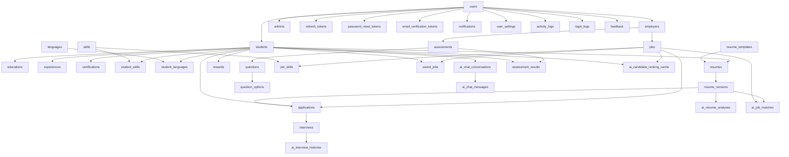
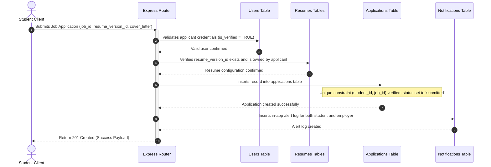

# Production MySQL Database Design: Integrated Career & Recruitment Portal

This document outlines the complete, production-ready relational database design for the **Integrated Career and Recruitment Portal** designed to meet **Third Normal Form (3NF)** standards.

---

## 1. Entity-Relationship (ER) Diagram

The following Mermaid diagram maps out the entities and their cardinalities.

```mermaid
erDiagram
    users ||--o| students : "is_a"
    users ||--o| employers : "is_a"
    users ||--o| admins : "is_a"
    users ||--o{ refresh_tokens : "has"
    users ||--o{ password_reset_tokens : "has"
    users ||--o{ email_verification_tokens : "has"
    users ||--o{ notifications : "receives"
    users ||--o| user_settings : "defines"
    users ||--o{ activity_logs : "triggers"
    users ||--o{ login_logs : "records"
    users ||--o{ feedback : "submits"

    students ||--o{ educations : "pursues"
    students ||--o{ experiences : "gained"
    students ||--o{ certifications : "holds"
    students ||--o{ student_skills : "possesses"
    students ||--o{ student_languages : "speaks"
    students ||--o{ saved_jobs : "saves"
    students ||--o{ applications : "submits"
    students ||--o{ resumes : "creates"
    students ||--o{ assessment_results : "obtains"
    students ||--o{ rewards : "earns"
    students ||--o{ ai_chat_conversations : "starts"

    employers ||--o{ jobs : "posts"
    employers ||--o{ assessments : "creates"
    employers ||--o{ interviews : "conducts"

    skills ||--o{ student_skills : "referenced_in"
    skills ||--o{ job_skills : "referenced_in"
    languages ||--o{ student_languages : "referenced_in"

    jobs ||--o{ job_skills : "requires"
    jobs ||--o{ saved_jobs : "referenced_in"
    jobs ||--o{ applications : "receives"
    jobs ||--o{ ai_candidate_ranking_cache : "ranks"

    resumes ||--o{ resume_versions : "tracks"
    resume_templates ||--o{ resumes : "skins"

    applications ||--o{ interviews : "scheduled_for"
    resume_versions ||--o{ applications : "applied_with"
    resume_versions ||--o{ ai_resume_analyses : "analyzed_in"
    resume_versions ||--o{ ai_job_matches : "matched_in"

    interviews ||--o| ai_interview_histories : "evaluated_by"
    ai_chat_conversations ||--o{ ai_chat_messages : "contains"
    
    assessments ||--o{ questions : "consists_of"
    questions ||--o{ question_options : "has"
    assessments ||--o{ assessment_results : "evaluated_via"
```



---

## 2. Table Dependency Diagram

To ensure data integrity, tables must be loaded or migrated in order of their dependencies:



---

## 3. Data Dictionary: Detailed Table Schemas

### Section 3.1: Identity & Authentication Module

#### 1. `users`
* **Justification**: Stores core login credentials and authentication attributes for all user types. By using a single `users` table and subclassing user types (`students`, `employers`, `admins`) using 1:1 relationships, we enforce email uniqueness across the entire system.
* **Columns**:
  * `id`: `INT AUTO_INCREMENT` | **PK**
  * `email`: `VARCHAR(191)` | **UQ** | Not Null
  * `password_hash`: `VARCHAR(255)` | Not Null
  * `role`: `ENUM('admin', 'student', 'employer')` | Not Null
  * `is_verified`: `BOOLEAN` | Default `FALSE`
  * `status`: `ENUM('active', 'suspended')` | Default `'active'`
  * `created_at`: `TIMESTAMP` | Default `CURRENT_TIMESTAMP`
  * `updated_at`: `TIMESTAMP` | Default `CURRENT_TIMESTAMP ON UPDATE CURRENT_TIMESTAMP`
* **Indexes**: 
  * `idx_users_email` ON (`email`)
  * `idx_users_role` ON (`role`)
* **Constraints**: None.

#### 2. `refresh_tokens`
* **Justification**: Stores cryptographic refresh tokens to safely implement JWT credentials rotation.
* **Columns**:
  * `id`: `BIGINT AUTO_INCREMENT` | **PK**
  * `user_id`: `INT` | **FK** | Not Null
  * `token`: `VARCHAR(255)` | **UQ** | Not Null
  * `expires_at`: `TIMESTAMP` | Not Null
  * `created_at`: `TIMESTAMP` | Default `CURRENT_TIMESTAMP`
  * `revoked_at`: `TIMESTAMP` | Null
* **Foreign Keys**:
  * `user_id` REFERENCES `users`(`id`) | **On Delete Cascade**
* **Indexes**:
  * `idx_rt_user` ON (`user_id`)
  * `idx_rt_token` ON (`token`)

#### 3. `password_reset_tokens`
* **Justification**: Secures user password resets by storing single-use recovery hashes with expiration times.
* **Columns**:
  * `id`: `BIGINT AUTO_INCREMENT` | **PK**
  * `user_id`: `INT` | **FK** | Not Null
  * `token`: `VARCHAR(255)` | **UQ** | Not Null
  * `expires_at`: `TIMESTAMP` | Not Null
  * `created_at`: `TIMESTAMP` | Default `CURRENT_TIMESTAMP`
  * `used_at`: `TIMESTAMP` | Null
* **Foreign Keys**:
  * `user_id` REFERENCES `users`(`id`) | **On Delete Cascade**
* **Indexes**:
  * `idx_pr_token` ON (`token`)

#### 4. `email_verification_tokens`
* **Justification**: Manages email verification codes sent during account registration.
* **Columns**:
  * `id`: `BIGINT AUTO_INCREMENT` | **PK**
  * `user_id`: `INT` | **FK** | Not Null
  * `token`: `VARCHAR(255)` | **UQ** | Not Null
  * `expires_at`: `TIMESTAMP` | Not Null
  * `created_at`: `TIMESTAMP` | Default `CURRENT_TIMESTAMP`
* **Foreign Keys**:
  * `user_id` REFERENCES `users`(`id`) | **On Delete Cascade**

---

### Section 3.2: User Profiles Module

#### 5. `students`
* **Justification**: Contains profile information specific to candidates. Connects to `users` via a 1:1 relationship.
* **Columns**:
  * `id`: `INT` | **PK** | **FK**
  * `first_name`: `VARCHAR(100)` | Not Null
  * `last_name`: `VARCHAR(100)` | Not Null
  * `phone`: `VARCHAR(20)` | Null
  * `date_of_birth`: `DATE` | Null
  * `avatar_url`: `VARCHAR(255)` | Null (S3/Cloudinary path)
  * `headline`: `VARCHAR(255)` | Null
  * `bio`: `TEXT` | Null
  * `github_url`: `VARCHAR(255)` | Null
  * `linkedin_url`: `VARCHAR(255)` | Null
  * `portfolio_url`: `VARCHAR(255)` | Null
  * `created_at`: `TIMESTAMP` | Default `CURRENT_TIMESTAMP`
  * `updated_at`: `TIMESTAMP` | Default `CURRENT_TIMESTAMP ON UPDATE CURRENT_TIMESTAMP`
* **Foreign Keys**:
  * `id` REFERENCES `users`(`id`) | **On Delete Cascade**

#### 6. `employers`
* **Justification**: Stores business details for verified employers. Connects to `users` via a 1:1 relationship.
* **Columns**:
  * `id`: `INT` | **PK** | **FK**
  * `company_name`: `VARCHAR(150)` | Not Null
  * `company_website`: `VARCHAR(255)` | Null
  * `company_logo_url`: `VARCHAR(255)` | Null
  * `company_industry`: `VARCHAR(100)` | Null
  * `company_size`: `ENUM('1-10', '11-50', '51-200', '201-500', '501-1000', '1000+')` | Null
  * `company_description`: `TEXT` | Null
  * `contact_phone`: `VARCHAR(20)` | Null
  * `is_approved`: `BOOLEAN` | Default `FALSE` (Moderated by Admin)
  * `created_at`: `TIMESTAMP` | Default `CURRENT_TIMESTAMP`
  * `updated_at`: `TIMESTAMP` | Default `CURRENT_TIMESTAMP ON UPDATE CURRENT_TIMESTAMP`
* **Foreign Keys**:
  * `id` REFERENCES `users`(`id`) | **On Delete Cascade**
* **Indexes**:
  * `idx_emp_approved` ON (`is_approved`)

#### 7. `admins`
* **Justification**: Stores administrative profile records. Connects to `users` via a 1:1 relationship.
* **Columns**:
  * `id`: `INT` | **PK** | **FK**
  * `full_name`: `VARCHAR(150)` | Not Null
  * `phone`: `VARCHAR(20)` | Null
  * `created_at`: `TIMESTAMP` | Default `CURRENT_TIMESTAMP`
  * `updated_at`: `TIMESTAMP` | Default `CURRENT_TIMESTAMP ON UPDATE CURRENT_TIMESTAMP`
* **Foreign Keys**:
  * `id` REFERENCES `users`(`id`) | **On Delete Cascade**

---

### Section 3.3: Student Resume & Portfolio Components

#### 8. `educations`
* **Justification**: Tracks academic records for student candidates.
* **Columns**:
  * `id`: `INT AUTO_INCREMENT` | **PK**
  * `student_id`: `INT` | **FK** | Not Null
  * `institution_name`: `VARCHAR(150)` | Not Null
  * `degree`: `VARCHAR(100)` | Not Null
  * `field_of_study`: `VARCHAR(100)` | Not Null
  * `start_date`: `DATE` | Not Null
  * `end_date`: `DATE` | Null (Null indicates current)
  * `grade_gpa`: `VARCHAR(20)` | Null
  * `description`: `TEXT` | Null
  * `created_at`: `TIMESTAMP` | Default `CURRENT_TIMESTAMP`
* **Foreign Keys**:
  * `student_id` REFERENCES `students`(`id`) | **On Delete Cascade**

#### 9. `experiences`
* **Justification**: Tracks employment history for student candidates.
* **Columns**:
  * `id`: `INT AUTO_INCREMENT` | **PK**
  * `student_id`: `INT` | **FK** | Not Null
  * `company_name`: `VARCHAR(150)` | Not Null
  * `job_title`: `VARCHAR(100)` | Not Null
  * `location`: `VARCHAR(150)` | Null
  * `start_date`: `DATE` | Not Null
  * `end_date`: `DATE` | Null
  * `is_current`: `BOOLEAN` | Default `FALSE`
  * `description`: `TEXT` | Null
  * `created_at`: `TIMESTAMP` | Default `CURRENT_TIMESTAMP`
* **Foreign Keys**:
  * `student_id` REFERENCES `students`(`id`) | **On Delete Cascade**

#### 10. `certifications`
* **Justification**: Tracks certifications obtained by student candidates.
* **Columns**:
  * `id`: `INT AUTO_INCREMENT` | **PK**
  * `student_id`: `INT` | **FK** | Not Null
  * `certification_name`: `VARCHAR(150)` | Not Null
  * `issuing_organization`: `VARCHAR(150)` | Not Null
  * `issue_date`: `DATE` | Null
  * `expiration_date`: `DATE` | Null
  * `credential_id`: `VARCHAR(100)` | Null
  * `credential_url`: `VARCHAR(255)` | Null
  * `created_at`: `TIMESTAMP` | Default `CURRENT_TIMESTAMP`
* **Foreign Keys**:
  * `student_id` REFERENCES `students`(`id`) | **On Delete Cascade**

#### 11. `skills`
* **Justification**: Master lookup table listing all skills on the platform. Enforces 3NF normalization by preventing repeated text fields in profiles and jobs.
* **Columns**:
  * `id`: `INT AUTO_INCREMENT` | **PK**
  * `name`: `VARCHAR(100)` | **UQ** | Not Null
* **Indexes**:
  * `idx_skills_name` ON (`name`)

#### 12. `student_skills`
* **Justification**: Junction table mapping student profiles to specific skills.
* **Columns**:
  * `student_id`: `INT` | **PK** | **FK**
  * `skill_id`: `INT` | **PK** | **FK**
  * `proficiency_level`: `ENUM('beginner', 'intermediate', 'advanced')` | Default `'intermediate'`
* **Foreign Keys**:
  * `student_id` REFERENCES `students`(`id`) | **On Delete Cascade**
  * `skill_id` REFERENCES `skills`(`id`) | **On Delete Cascade**

#### 13. `languages`
* **Justification**: Lookup table mapping language names.
* **Columns**:
  * `id`: `INT AUTO_INCREMENT` | **PK**
  * `name`: `VARCHAR(50)` | **UQ** | Not Null

#### 14. `student_languages`
* **Justification**: Junction table mapping students to languages they speak.
* **Columns**:
  * `student_id`: `INT` | **PK** | **FK**
  * `language_id`: `INT` | **PK** | **FK**
  * `proficiency`: `ENUM('basic', 'intermediate', 'fluent', 'native')` | Default `'basic'`
* **Foreign Keys**:
  * `student_id` REFERENCES `students`(`id`) | **On Delete Cascade**
  * `language_id` REFERENCES `languages`(`id`) | **On Delete Cascade**

---

### Section 3.4: Resume Builder Module

#### 15. `resume_templates`
* **Justification**: Stores stylistic configurations (font family, colors, grid sizes) for the live preview templates in the Resume Builder.
* **Columns**:
  * `id`: `INT AUTO_INCREMENT` | **PK**
  * `name`: `VARCHAR(50)` | **UQ** | Not Null
  * `style_config`: `JSON` | Not Null
  * `is_public`: `BOOLEAN` | Default `TRUE`
  * `created_at`: `TIMESTAMP` | Default `CURRENT_TIMESTAMP`

#### 16. `resumes`
* **Justification**: Groups saved resume versions for students.
* **Columns**:
  * `id`: `INT AUTO_INCREMENT` | **PK**
  * `student_id`: `INT` | **FK** | Not Null
  * `title`: `VARCHAR(100)` | Default `'My Resume'`
  * `template_id`: `INT` | **FK** | Not Null
  * `is_active`: `BOOLEAN` | Default `TRUE`
  * `created_at`: `TIMESTAMP` | Default `CURRENT_TIMESTAMP`
  * `updated_at`: `TIMESTAMP` | Default `CURRENT_TIMESTAMP ON UPDATE CURRENT_TIMESTAMP`
* **Foreign Keys**:
  * `student_id` REFERENCES `students`(`id`) | **On Delete Cascade**
  * `template_id` REFERENCES `resume_templates`(`id`) | **On Delete Restrict**

#### 17. `resume_versions`
* **Justification**: Tracks version history for each resume configuration, storing data as structured JSON payloads. This allows students to roll back changes and keeps historical files intact for past job applications.
* **Columns**:
  * `id`: `INT AUTO_INCREMENT` | **PK**
  * `resume_id`: `INT` | **FK** | Not Null
  * `version_number`: `INT` | Not Null
  * `resume_data_json`: `JSON` | Not Null (Stores structural fields: summary, education details, experiences, etc.)
  * `file_url`: `VARCHAR(255)` | Null (S3 path targeting generated PDF file)
  * `created_at`: `TIMESTAMP` | Default `CURRENT_TIMESTAMP`
* **Foreign Keys**:
  * `resume_id` REFERENCES `resumes`(`id`) | **On Delete Cascade**
* **Constraints**:
  * Unique key constraint on (`resume_id`, `version_number`) to maintain version sequential integrity.

---

### Section 3.5: Job Postings & Applications Module

#### 18. `jobs`
* **Justification**: Stores job postings created by employers.
* **Columns**:
  * `id`: `INT AUTO_INCREMENT` | **PK**
  * `employer_id`: `INT` | **FK** | Not Null
  * `title`: `VARCHAR(150)` | Not Null
  * `description`: `TEXT` | Not Null
  * `requirements`: `TEXT` | Not Null
  * `location`: `VARCHAR(150)` | Not Null
  * `employment_type`: `ENUM('full-time', 'part-time', 'contract', 'internship')` | Not Null
  * `work_mode`: `ENUM('on-site', 'hybrid', 'remote')` | Not Null
  * `salary_min`: `DECIMAL(12, 2)` | Null
  * `salary_max`: `DECIMAL(12, 2)` | Null
  * `status`: `ENUM('draft', 'active', 'closed', 'flagged')` | Default `'draft'`
  * `created_at`: `TIMESTAMP` | Default `CURRENT_TIMESTAMP`
  * `updated_at`: `TIMESTAMP` | Default `CURRENT_TIMESTAMP ON UPDATE CURRENT_TIMESTAMP`
* **Foreign Keys**:
  * `employer_id` REFERENCES `employers`(`id`) | **On Delete Cascade**
* **Indexes**:
  * `idx_jobs_employer` ON (`employer_id`)
  * `idx_jobs_status` ON (`status`)
  * `idx_jobs_search` ON (`title`, `location`)

#### 19. `job_skills`
* **Justification**: Junction table mapping job postings to their required skills.
* **Columns**:
  * `job_id`: `INT` | **PK** | **FK**
  * `skill_id`: `INT` | **PK** | **FK**
  * `is_required`: `BOOLEAN` | Default `TRUE`
* **Foreign Keys**:
  * `job_id` REFERENCES `jobs`(`id`) | **On Delete Cascade**
  * `skill_id` REFERENCES `skills`(`id`) | **On Delete Cascade**

#### 20. `saved_jobs`
* **Justification**: Tracks jobs saved by candidates.
* **Columns**:
  * `student_id`: `INT` | **PK** | **FK**
  * `job_id`: `INT` | **PK** | **FK**
  * `saved_at`: `TIMESTAMP` | Default `CURRENT_TIMESTAMP`
* **Foreign Keys**:
  * `student_id` REFERENCES `students`(`id`) | **On Delete Cascade**
  * `job_id` REFERENCES `jobs`(`id`) | **On Delete Cascade**

#### 21. `applications`
* **Justification**: Maps candidate job applications to specific jobs, freezing the resume version used at the time of submission.
* **Columns**:
  * `id`: `INT AUTO_INCREMENT` | **PK**
  * `student_id`: `INT` | **FK** | Not Null
  * `job_id`: `INT` | **FK** | Not Null
  * `resume_version_id`: `INT` | **FK** | Not Null (Points to the static resume version submitted)
  * `status`: `ENUM('submitted', 'under_review', 'shortlisted', 'rejected', 'offered', 'hired')` | Default `'submitted'`
  * `cover_letter`: `TEXT` | Null
  * `created_at`: `TIMESTAMP` | Default `CURRENT_TIMESTAMP`
  * `updated_at`: `TIMESTAMP` | Default `CURRENT_TIMESTAMP ON UPDATE CURRENT_TIMESTAMP`
* **Foreign Keys**:
  * `student_id` REFERENCES `students`(`id`) | **On Delete Cascade**
  * `job_id` REFERENCES `jobs`(`id`) | **On Delete Cascade**
  * `resume_version_id` REFERENCES `resume_versions`(`id`) | **On Delete Restrict**
* **Constraints**:
  * Unique key constraint on (`student_id`, `job_id`) to prevent duplicate applications for a single job listing.
* **Indexes**:
  * `idx_app_student` ON (`student_id`)
  * `idx_app_job` ON (`job_id`)
  * `idx_app_status` ON (`status`)

---

### Section 3.6: Skill Assessment Module

#### 22. `assessments`
* **Justification**: Stores standard domain skills assessments (created by platform admins) or custom assessments (created by employers).
* **Columns**:
  * `id`: `INT AUTO_INCREMENT` | **PK**
  * `title`: `VARCHAR(150)` | Not Null
  * `description`: `TEXT` | Null
  * `duration_minutes`: `INT` | Not Null
  * `type`: `ENUM('domain_test', 'employer_test')` | Default `'domain_test'`
  * `employer_id`: `INT` | **FK** | Null (NULL for system-wide domain tests; points to the employer for custom tests)
  * `created_at`: `TIMESTAMP` | Default `CURRENT_TIMESTAMP`
  * `updated_at`: `TIMESTAMP` | Default `CURRENT_TIMESTAMP ON UPDATE CURRENT_TIMESTAMP`
* **Foreign Keys**:
  * `employer_id` REFERENCES `employers`(`id`) | **On Delete Cascade**

#### 23. `questions`
* **Justification**: Contains assessment questions linked to specific test modules.
* **Columns**:
  * `id`: `INT AUTO_INCREMENT` | **PK**
  * `assessment_id`: `INT` | **FK** | Not Null
  * `question_text`: `TEXT` | Not Null
  * `question_type`: `ENUM('single_choice', 'multiple_choice', 'coding')` | Default `'single_choice'`
  * `points`: `INT` | Default `1`
  * `created_at`: `TIMESTAMP` | Default `CURRENT_TIMESTAMP`
* **Foreign Keys**:
  * `assessment_id` REFERENCES `assessments`(`id`) | **On Delete Cascade**

#### 24. `question_options`
* **Justification**: Multiple choice option records for single or multiple selection questions.
* **Columns**:
  * `id`: `INT AUTO_INCREMENT` | **PK**
  * `question_id`: `INT` | **FK** | Not Null
  * `option_text`: `TEXT` | Not Null
  * `is_correct`: `BOOLEAN` | Default `FALSE`
  * `created_at`: `TIMESTAMP` | Default `CURRENT_TIMESTAMP`
* **Foreign Keys**:
  * `question_id` REFERENCES `questions`(`id`) | **On Delete Cascade**

#### 25. `assessment_results`
* **Justification**: Tracks score details for assessments completed by candidates.
* **Columns**:
  * `id`: `BIGINT AUTO_INCREMENT` | **PK**
  * `student_id`: `INT` | **FK** | Not Null
  * `assessment_id`: `INT` | **FK** | Not Null
  * `score`: `DECIMAL(5, 2)` | Not Null (Represents percentage: 00.00% to 100.00%)
  * `passed`: `BOOLEAN` | Not Null
  * `started_at`: `TIMESTAMP` | Default `CURRENT_TIMESTAMP`
  * `completed_at`: `TIMESTAMP` | Null
* **Foreign Keys**:
  * `student_id` REFERENCES `students`(`id`) | **On Delete Cascade**
  * `assessment_id` REFERENCES `assessments`(`id`) | **On Delete Cascade**
* **Indexes**:
  * `idx_ass_res_student` ON (`student_id`)

#### 26. `rewards`
* **Justification**: Stores profile badges awarded to students who score highly on platform-wide domain tests.
* **Columns**:
  * `id`: `INT AUTO_INCREMENT` | **PK**
  * `student_id`: `INT` | **FK** | Not Null
  * `badge_name`: `VARCHAR(100)` | Not Null
  * `badge_icon_url`: `VARCHAR(255)` | Not Null
  * `description`: `TEXT` | Null
  * `awarded_at`: `TIMESTAMP` | Default `CURRENT_TIMESTAMP`
* **Foreign Keys**:
  * `student_id` REFERENCES `students`(`id`) | **On Delete Cascade**

---

### Section 3.7: Interview Scheduling Module

#### 27. `interviews`
* **Justification**: Stores scheduled interview sessions link records mapped directly to applications.
* **Columns**:
  * `id`: `INT AUTO_INCREMENT` | **PK**
  * `application_id`: `INT` | **FK** | Not Null
  * `interviewer_id`: `INT` | **FK** | Not Null (Points to the employer's `users` ID)
  * `scheduled_time`: `TIMESTAMP` | Not Null
  * `meeting_link`: `VARCHAR(255)` | Not Null (URL)
  * `status`: `ENUM('scheduled', 'rescheduled', 'completed', 'cancelled')` | Default `'scheduled'`
  * `feedback_text`: `TEXT` | Null
  * `score`: `INT` | Null (Rating score, e.g. 1-10)
  * `created_at`: `TIMESTAMP` | Default `CURRENT_TIMESTAMP`
  * `updated_at`: `TIMESTAMP` | Default `CURRENT_TIMESTAMP ON UPDATE CURRENT_TIMESTAMP`
* **Foreign Keys**:
  * `application_id` REFERENCES `applications`(`id`) | **On Delete Cascade**
  * `interviewer_id` REFERENCES `employers`(`id`) | **On Delete Cascade**
* **Indexes**:
  * `idx_interviews_time` ON (`scheduled_time`)
  * `idx_interviews_status` ON (`status`)

---

### Section 3.8: Notifications & Feedback Modules

#### 28. `notifications`
* **Justification**: Centralized log containing notification records for in-app widgets.
* **Columns**:
  * `id`: `BIGINT AUTO_INCREMENT` | **PK**
  * `user_id`: `INT` | **FK** | Not Null (The recipient)
  * `title`: `VARCHAR(150)` | Not Null
  * `message`: `TEXT` | Not Null
  * `type`: `ENUM('in-app', 'email', 'both')` | Default `'in-app'`
  * `category`: `ENUM('application_update', 'interview_invite', 'assessment_invite', 'system_alert')` | Not Null
  * `is_read`: `BOOLEAN` | Default `FALSE`
  * `created_at`: `TIMESTAMP` | Default `CURRENT_TIMESTAMP`
* **Foreign Keys**:
  * `user_id` REFERENCES `users`(`id`) | **On Delete Cascade**
* **Indexes**:
  * `idx_notif_user_unread` ON (`user_id`, `is_read`)

#### 29. `feedback`
* **Justification**: Collects portal feedback ratings from users.
* **Columns**:
  * `id`: `INT AUTO_INCREMENT` | **PK**
  * `user_id`: `INT` | **FK** | Not Null (The author)
  * `target_type`: `ENUM('platform', 'employer', 'student')` | Not Null
  * `target_id`: `INT` | Not Null (Polymorphic key referencing target entity ID)
  * `rating`: `TINYINT` | Not Null (Value between 1 and 5)
  * `comment`: `TEXT` | Null
  * `created_at`: `TIMESTAMP` | Default `CURRENT_TIMESTAMP`
* **Foreign Keys**:
  * `user_id` REFERENCES `users`(`id`) | **On Delete Cascade**
* **Constraints**:
  * Check constraint checking that `rating` is between 1 and 5.

---

### Section 3.9: AI Engine Integration Module

#### 30. `ai_resume_analyses`
* **Justification**: Stores AI evaluation results and ATS keyword metrics for resume configurations.
* **Columns**:
  * `id`: `INT AUTO_INCREMENT` | **PK**
  * `resume_version_id`: `INT` | **FK** | Not Null
  * `ats_score`: `TINYINT` | Not Null (ATS compatibility score out of 100)
  * `skills_found_json`: `JSON` | Not Null (Array of matched skills)
  * `improvement_suggestions_json`: `JSON` | Not Null (Categorized suggestions)
  * `analyzed_at`: `TIMESTAMP` | Default `CURRENT_TIMESTAMP`
* **Foreign Keys**:
  * `resume_version_id` REFERENCES `resume_versions`(`id`) | **On Delete Cascade**

#### 31. `ai_job_matches`
* **Justification**: Stores compatibility scores comparing a candidate's resume with a target job listing.
* **Columns**:
  * `id`: `INT AUTO_INCREMENT` | **PK**
  * `resume_version_id`: `INT` | **FK** | Not Null
  * `job_id`: `INT` | **FK** | Not Null
  * `match_score`: `TINYINT` | Not Null (0-100 score)
  * `skills_gap_json`: `JSON` | Not Null (Lists required skills missing from the resume)
  * `reasoning_text`: `TEXT` | Null
  * `matched_at`: `TIMESTAMP` | Default `CURRENT_TIMESTAMP`
* **Foreign Keys**:
  * `resume_version_id` REFERENCES `resume_versions`(`id`) | **On Delete Cascade**
  * `job_id` REFERENCES `jobs`(`id`) | **On Delete Cascade**
* **Indexes**:
  * `idx_ai_match` ON (`resume_version_id`, `job_id`)

#### 32. `ai_chat_conversations`
* **Justification**: Groups chat history sessions between students and the AI career mentor.
* **Columns**:
  * `id`: `INT AUTO_INCREMENT` | **PK**
  * `student_id`: `INT` | **FK** | Not Null
  * `title`: `VARCHAR(150)` | Default `'New Conversation'`
  * `created_at`: `TIMESTAMP` | Default `CURRENT_TIMESTAMP`
  * `updated_at`: `TIMESTAMP` | Default `CURRENT_TIMESTAMP ON UPDATE CURRENT_TIMESTAMP`
* **Foreign Keys**:
  * `student_id` REFERENCES `students`(`id`) | **On Delete Cascade**

#### 33. `ai_chat_messages`
* **Justification**: Stores individual messages for AI mentor chat conversations.
* **Columns**:
  * `id`: `BIGINT AUTO_INCREMENT` | **PK**
  * `conversation_id`: `INT` | **FK** | Not Null
  * `sender`: `ENUM('student', 'ai')` | Not Null
  * `message_text`: `TEXT` | Not Null
  * `created_at`: `TIMESTAMP` | Default `CURRENT_TIMESTAMP`
* **Foreign Keys**:
  * `conversation_id` REFERENCES `ai_chat_conversations`(`id`) | **On Delete Cascade**

#### 34. `ai_interview_histories`
* **Justification**: Stores transcripts and performance reviews generated from AI mock interview sessions.
* **Columns**:
  * `id`: `INT AUTO_INCREMENT` | **PK**
  * `interview_id`: `INT` | **FK** | Not Null (Points to the schedule mock session ID)
  * `transcript_json`: `JSON` | Not Null (List of dialogue questions and answers)
  * `overall_score`: `TINYINT` | Not Null (Performance rating)
  * `weakness_feedback`: `TEXT` | Null
  * `strength_feedback`: `TEXT` | Null
  * `analyzed_at`: `TIMESTAMP` | Default `CURRENT_TIMESTAMP`
* **Foreign Keys**:
  * `interview_id` REFERENCES `interviews`(`id`) | **On Delete Cascade**

#### 35. `ai_candidate_ranking_cache`
* **Justification**: Caches AI candidate match rankings for each job. Using a cached rank table avoids running expensive LLM match operations on the fly when recruiters browse applicants.
* **Columns**:
  * `id`: `BIGINT AUTO_INCREMENT` | **PK**
  * `job_id`: `INT` | **FK** | Not Null
  * `student_id`: `INT` | **FK** | Not Null
  * `ai_match_score`: `TINYINT` | Not Null
  * `updated_at`: `TIMESTAMP` | Default `CURRENT_TIMESTAMP` ON UPDATE CURRENT_TIMESTAMP
* **Foreign Keys**:
  * `job_id` REFERENCES `jobs`(`id`) ON DELETE CASCADE
  * `student_id` REFERENCES `students`(`id`) ON DELETE CASCADE
* **Constraints**:
  * Unique key constraint on (`job_id`, `student_id`).
* **Indexes**:
  * `idx_ai_rank_cache` ON (`job_id`, `ai_match_score` DESC)

---

### Section 3.10: Audit Logs Module

#### 36. `activity_logs`
* **Justification**: Stores activity records for system events to audit platform actions and security.
* **Columns**:
  * `id`: `BIGINT AUTO_INCREMENT` | **PK**
  * `user_id`: `INT` | **FK** | Null (NULL indicates actions performed by guest/unregistered users)
  * `action`: `VARCHAR(100)` | Not Null (e.g. `'post_job'`, `'delete_profile'`)
  * `ip_address`: `VARCHAR(45)` | Not Null
  * `user_agent`: `VARCHAR(255)` | Not Null
  * `created_at`: `TIMESTAMP` | Default `CURRENT_TIMESTAMP`
* **Foreign Keys**:
  * `user_id` REFERENCES `users`(`id`) | **On Delete Set Null**
* **Indexes**:
  * `idx_act_logs_user` ON (`user_id`)
  * `idx_act_logs_created` ON (`created_at`)

#### 37. `login_logs`
* **Justification**: Records user login attempts, IPs, and failure modes to track authentication anomalies.
* **Columns**:
  * `id`: `BIGINT AUTO_INCREMENT` | **PK**
  * `user_id`: `INT` | **FK** | Not Null
  * `login_time`: `TIMESTAMP` | Default `CURRENT_TIMESTAMP`
  * `ip_address`: `VARCHAR(45)` | Not Null
  * `user_agent`: `VARCHAR(255)` | Not Null
  * `login_status`: `ENUM('success', 'failed')` | Not Null
  * `failure_reason`: `VARCHAR(100)` | Null
* **Foreign Keys**:
  * `user_id` REFERENCES `users`(`id`) | **On Delete Cascade**
* **Indexes**:
  * `idx_login_logs_user` ON (`user_id`, `login_status`)

---

## 4. Database Security, Cascade Rules & Constraints

### Cascade Rules Strategy
1. **`ON DELETE CASCADE`**: Used for parent-child entities. For example, if a `user` is deleted, their tokens, profiles, settings, and logs are deleted automatically. If a `student` profile is deleted, their associated experience, education, and resume records are removed.
2. **`ON DELETE RESTRICT`**: Applied to critical historical records. For example, a `resume_version` cannot be deleted if it is linked to an active job `application`. Similarly, lookup values in `resume_templates` cannot be deleted if active profiles reference them.
3. **`ON DELETE SET NULL`**: Used for non-critical logs (such as setting `user_id` in `activity_logs` to NULL if the user account is deleted) to preserve audit trails.

### Safety Constraints
* **Enforcing Valid Ratings**: Checks rating values inside the `feedback` table:
  `CONSTRAINT chk_feedback_rating CHECK (rating BETWEEN 1 AND 5)`
* **Positive Salaries**: Enforces that salary ranges in the `jobs` table are positive values:
  `CONSTRAINT chk_salary_positive CHECK (salary_min >= 0 AND salary_max >= salary_min)`
* **ATS Score Range**: Validates ATS scores inside AI tables:
  `CONSTRAINT chk_ats_score CHECK (ats_score BETWEEN 0 AND 100)`
* **End Dates**: Enforces that experience and education end dates are greater than or equal to start dates:
  `CONSTRAINT chk_dates CHECK (end_date IS NULL OR end_date >= start_date)`

---

## 5. Performance Index Optimization Choices

To ensure the database queries efficiently under load, the following indices are configured:

1. **Covering Index for Jobs searches**:
   - `idx_jobs_search` ON `jobs`(`status`, `work_mode`, `employment_type`, `created_at` DESC)
   - *Rationale*: Speeds up dashboard job searches and paginated listings, which are filtered by status and job parameters.
2. **Compound Index for Notification Unreads**:
   - `idx_notif_user_unread` ON `notifications`(`user_id`, `is_read`, `created_at` DESC)
   - *Rationale*: Speeds up rendering of in-app notification count badges and headers.
3. **Candidate Applications covering index**:
   - `idx_app_metrics` ON `applications`(`job_id`, `status`)
   - *Rationale*: Speeds up query aggregation for employer candidate funnel analytics.
4. **AI Match Score Index**:
   - `idx_ai_rank_cache` ON `ai_candidate_ranking_cache`(`job_id`, `ai_match_score` DESC)
   - *Rationale*: Allows recruiters to sort candidates by matching compatibility scores instantly.
5. **Activity Log Time Index**:
   - `idx_act_logs_created` ON `activity_logs`(`created_at`)
   - *Rationale*: Optimizes cleanup queries that remove logs older than 90 days.

---

## 6. Sample Data Flow Diagram

The following sequence outlines how tables record data during a standard candidate application event:



---

## 7. Extended Production Database Schema

This section documents the database schema extensions designed to support advanced production operations. All new entities adhere to 3NF standards and maintain clean relational linkages with the primary schema.

### Section 7.1: Company Reviews Module

#### 38. `company_reviews`
* **Justification**: Allows students to review companies they have interviewed at or worked for. Includes admin approval controls to prevent spam.
* **Columns**:
  * `id`: `INT AUTO_INCREMENT` | **PK**
  * `student_id`: `INT` | **FK** | Not Null (The student writing the review)
  * `employer_id`: `INT` | **FK** | Not Null (The company being reviewed)
  * `rating`: `TINYINT` | Not Null (Value between 1 and 5)
  * `review`: `TEXT` | Not Null
  * `anonymous`: `BOOLEAN` | Default `FALSE` (Hides student name on public pages)
  * `approved_by_admin`: `BOOLEAN` | Default `FALSE` (Requires moderator approval before rendering)
  * `created_at`: `TIMESTAMP` | Default `CURRENT_TIMESTAMP`
* **Foreign Keys**:
  * `student_id` REFERENCES `students`(`id`) | **On Delete Cascade**
  * `employer_id` REFERENCES `employers`(`id`) | **On Delete Cascade**
* **Constraints**:
  * `CONSTRAINT chk_review_rating CHECK (rating BETWEEN 1 AND 5)`
* **Indexes**:
  * `idx_reviews_employer` ON (`employer_id`, `approved_by_admin`)

---

### Section 7.2: Student Bookmark Collections

#### 39. `bookmark_collections`
* **Justification**: Groups student bookmarked/saved jobs into customized folders (e.g. "Dream Companies", "Remote Jobs").
* **Columns**:
  * `id`: `INT AUTO_INCREMENT` | **PK**
  * `student_id`: `INT` | **FK** | Not Null
  * `name`: `VARCHAR(100)` | Not Null (The custom folder name)
  * `created_at`: `TIMESTAMP` | Default `CURRENT_TIMESTAMP`
  * `updated_at`: `TIMESTAMP` | Default `CURRENT_TIMESTAMP` ON UPDATE CURRENT_TIMESTAMP
* **Foreign Keys**:
  * `student_id` REFERENCES `students`(`id`) | **On Delete Cascade**
* **Constraints**:
  * Unique key constraint on (`student_id`, `name`) to prevent folders with duplicate names for a single student.

#### 40. `bookmark_collection_jobs`
* **Justification**: Junction table mapping job postings to specific bookmark collection folders.
* **Columns**:
  * `bookmark_collection_id`: `INT` | **PK** | **FK**
  * `job_id`: `INT` | **PK** | **FK**
  * `saved_at`: `TIMESTAMP` | Default `CURRENT_TIMESTAMP`
* **Foreign Keys**:
  * `bookmark_collection_id` REFERENCES `bookmark_collections`(`id`) | **On Delete Cascade**
  * `job_id` REFERENCES `jobs`(`id`) | **On Delete Cascade**

---

### Section 7.3: Student Documents Module

#### 41. `student_documents`
* **Justification**: Manages file paths for miscellaneous student-uploaded documents (e.g. standalone cover letters, portfolios, certificate files).
* **Columns**:
  * `id`: `INT AUTO_INCREMENT` | **PK**
  * `student_id`: `INT` | **FK** | Not Null
  * `document_type`: `ENUM('resume', 'cover_letter', 'certificate', 'portfolio')` | Not Null
  * `file_name`: `VARCHAR(150)` | Not Null
  * `file_url`: `VARCHAR(255)` | Not Null (Cloud storage path reference)
  * `created_at`: `TIMESTAMP` | Default `CURRENT_TIMESTAMP`
  * `updated_at`: `TIMESTAMP` | Default `CURRENT_TIMESTAMP` ON UPDATE CURRENT_TIMESTAMP
* **Foreign Keys**:
  * `student_id` REFERENCES `students`(`id`) | **On Delete Cascade**
* **Indexes**:
  * `idx_student_docs` ON (`student_id`, `document_type`)

---

### Section 7.4: Job Metadata Lookup Tables (ENUM Replacements)

To improve system configuration and query flexibility, ENUM columns in the core `jobs` table are replaced by foreign keys pointing to lookup tables:

```
[Old Design: ENUMs in jobs] ──> [New Design: Lookup Tables]
* jobs.category      ──> FK to job_categories.id
* jobs.work_mode     ──> FK to work_modes.id
* jobs.job_type      ──> FK to job_types.id
```

#### 42. `job_categories`
* **Justification**: Master lookup table defining distinct job categories (e.g., "Software Engineering", "Sales").
* **Columns**:
  * `id`: `INT AUTO_INCREMENT` | **PK**
  * `name`: `VARCHAR(100)` | **UQ** | Not Null
  * `description`: `TEXT` | Null

#### 43. `job_types`
* **Justification**: Lookup table mapping employment types (e.g., "Full-time", "Contract", "Internship").
* **Columns**:
  * `id`: `TINYINT AUTO_INCREMENT` | **PK**
  * `name`: `VARCHAR(50)` | **UQ** | Not Null

#### 44. `work_modes`
* **Justification**: Lookup table mapping working configurations (e.g., "Remote", "Hybrid", "On-site").
* **Columns**:
  * `id`: `TINYINT AUTO_INCREMENT` | **PK**
  * `name`: `VARCHAR(50)` | **UQ** | Not Null

---

### Section 7.5: Application Timeline & History

#### 45. `application_history`
* **Justification**: Automatically logs every event and state transition in the lifecycle of a job application (e.g. Applied -> Viewed -> Shortlisted -> Hired) to provide candidates with a detailed timeline view.
* **Columns**:
  * `id`: `BIGINT AUTO_INCREMENT` | **PK**
  * `application_id`: `INT` | **FK** | Not Null
  * `status`: `ENUM('submitted', 'viewed', 'under_review', 'shortlisted', 'interview_scheduled', 'rejected', 'offered', 'hired')` | Not Null
  * `status_changed_by`: `INT` | **FK** | Not Null (References `users.id` of the actor performing the transition)
  * `notes`: `TEXT` | Null (Optional details or reasons, e.g. rejection notes)
  * `created_at`: `TIMESTAMP` | Default `CURRENT_TIMESTAMP`
* **Foreign Keys**:
  * `application_id` REFERENCES `applications`(`id`) | **On Delete Cascade**
  * `status_changed_by` REFERENCES `users`(`id`) | **On Delete Restrict**
* **Indexes**:
  * `idx_app_history` ON (`application_id`, `created_at`)

---

### Section 7.6: Recruiter Candidate Management

#### 46. `employer_notes`
* **Justification**: Stores private, recruiter-only notes about applicants during the evaluation process.
* **Columns**:
  * `id`: `INT AUTO_INCREMENT` | **PK**
  * `application_id`: `INT` | **FK** | Not Null
  * `recruiter_id`: `INT` | **FK** | Not Null (Points to employer/recruiter `users.id`)
  * `note_text`: `TEXT` | Not Null
  * `created_at`: `TIMESTAMP` | Default `CURRENT_TIMESTAMP`
  * `updated_at`: `TIMESTAMP` | Default `CURRENT_TIMESTAMP` ON UPDATE CURRENT_TIMESTAMP
* **Foreign Keys**:
  * `application_id` REFERENCES `applications`(`id`) | **On Delete Cascade**
  * `recruiter_id` REFERENCES `employers`(`id`) | **On Delete Cascade**

---

### Section 7.7: Communication & Verification Logs

#### 47. `email_logs`
* **Justification**: Logs all outbound transactional emails sent by the system (e.g. password resets, verification links) for tracking and debugging.
* **Columns**:
  * `id`: `BIGINT AUTO_INCREMENT` | **PK**
  * `recipient_email`: `VARCHAR(191)` | Not Null
  * `email_type`: `ENUM('forgot_password', 'interview_invite', 'application_update', 'welcome_email')` | Not Null
  * `subject`: `VARCHAR(255)` | Not Null
  * `status`: `ENUM('queued', 'sent', 'failed')` | Default `'queued'`
  * `error_message`: `TEXT` | Null (Contains delivery fail logs if applicable)
  * `sent_at`: `TIMESTAMP` | Null
* **Indexes**:
  * `idx_email_recipient` ON (`recipient_email`)
  * `idx_email_status` ON (`status`)

#### 48. `otp_codes`
* **Justification**: Generates and audits temporal verification codes (OTPs) for 2FA actions or email confirmations.
* **Columns**:
  * `id`: `BIGINT AUTO_INCREMENT` | **PK**
  * `user_id`: `INT` | **FK** | Not Null
  * `otp_code_hash`: `VARCHAR(255)` | Not Null (Hashed OTP string)
  * `action_type`: `ENUM('email_verification', 'password_reset', '2fa')` | Not Null
  * `expires_at`: `TIMESTAMP` | Not Null
  * `created_at`: `TIMESTAMP` | Default `CURRENT_TIMESTAMP`
  * `verified_at`: `TIMESTAMP` | Null
* **Foreign Keys**:
  * `user_id` REFERENCES `users`(`id`) | **On Delete Cascade**
* **Indexes**:
  * `idx_otp_validation` ON (`user_id`, `expires_at`)

---

### Section 7.8: Moderation, Cache & System Configurations

#### 49. `reports`
* **Justification**: Allows students to flag jobs, employers, or users for terms of service violations.
* **Columns**:
  * `id`: `INT AUTO_INCREMENT` | **PK**
  * `reporter_user_id`: `INT` | **FK** | Not Null (The student reporting the issue)
  * `target_type`: `ENUM('job', 'employer', 'user')` | Not Null
  * `target_id`: `INT` | Not Null (Polymorphic entity identifier matching selected target type)
  * `reason`: `TEXT` | Not Null
  * `status`: `ENUM('pending', 'investigating', 'resolved', 'dismissed')` | Default `'pending'`
  * `admin_notes`: `TEXT` | Null
  * `created_at`: `TIMESTAMP` | Default `CURRENT_TIMESTAMP`
  * `updated_at`: `TIMESTAMP` | Default `CURRENT_TIMESTAMP` ON UPDATE CURRENT_TIMESTAMP
* **Foreign Keys**:
  * `reporter_user_id` REFERENCES `users`(`id`) | **On Delete Cascade**
* **Indexes**:
  * `idx_reports_status` ON (`status`)

#### 50. `dashboard_cache`
* **Justification**: Caches pre-calculated, heavy dashboard analytics (e.g. system usage statistics for admins, candidate funnels for employers) to prevent slow queries on the UI.
* **Columns**:
  * `id`: `INT AUTO_INCREMENT` | **PK**
  * `cache_key`: `VARCHAR(191)` | **UQ** | Not Null (e.g., `'admin_registration_stats_week'`)
  * `cache_data`: `JSON` | Not Null
  * `expires_at`: `TIMESTAMP` | Not Null
  * `updated_at`: `TIMESTAMP` | Default `CURRENT_TIMESTAMP` ON UPDATE CURRENT_TIMESTAMP
* **Indexes**:
  * `idx_cache_expires` ON (`expires_at`)

---

### Section 7.9: Safety & Device Registration

#### 51. `device_tokens`
* **Justification**: Registers FCM/APNs push notification identifiers for future mobile application integrations.
* **Columns**:
  * `id`: `BIGINT AUTO_INCREMENT` | **PK**
  * `user_id`: `INT` | **FK** | Not Null
  * `token`: `VARCHAR(255)` | **UQ** | Not Null
  * `platform`: `ENUM('ios', 'android')` | Not Null
  * `created_at`: `TIMESTAMP` | Default `CURRENT_TIMESTAMP`
  * `updated_at`: `TIMESTAMP` | Default `CURRENT_TIMESTAMP` ON UPDATE CURRENT_TIMESTAMP
* **Foreign Keys**:
  * `user_id` REFERENCES `users`(`id`) | **On Delete Cascade**

#### Soft Delete Fields
A `deleted_at` field is added to the following core entities to support logical deletion, preserving audit logs and historical transactions:
- `users`: `deleted_at` `TIMESTAMP NULL` (Cascades logical deletion state to corresponding profile records)
- `students`: `deleted_at` `TIMESTAMP NULL`
- `employers`: `deleted_at` `TIMESTAMP NULL`
- `jobs`: `deleted_at` `TIMESTAMP NULL`

Queries for active listings must include: `WHERE deleted_at IS NULL`

